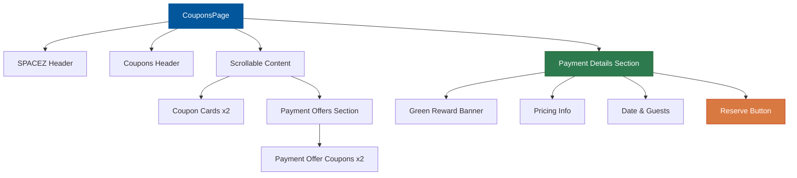

<div align="center">

# 🎫 SPACEZ Coupons App


### 🚀 A Beautiful Flutter Application for Managing Coupons & Payment Offers

[Features](#-features) • [Screenshots](#-screenshots) • [Installation](#-installation) • [Tech Stack](#-tech-stack)

</div>

---

## 📋 Overview

A modern, responsive Flutter application built for **SPACEZ** that showcases an elegant coupon management system with a clean UI/UX design. This project was developed as part of a Flutter internship assignment, focusing on pixel-perfect implementation from Figma designs.

<div align="center">

```ascii
╔═══════════════════════════════════════════════════════════╗
║                    SPACEZ COUPONS                         ║
║  ┌─────────────────────────────────────────────────────┐  ║
║  │  🏠 SPACEZ                              ☰           │  ║
║  ├─────────────────────────────────────────────────────┤  ║
║  │  ← Coupons                                          │  ║
║  ├─────────────────────────────────────────────────────┤  ║
║  │  📜 Coupon Cards (Scrollable)                       │  ║
║  │     ├─ ₹2000 | LONGSTAY                            │  ║
║  │     └─ ₹100 | LONGSTAY                             │  ║
║  │                                                      │  ║
║  │  💳 Payment Offers:                                 │  ║
║  │     ├─ ₹100 | LONGSTAY                             │  ║
║  │     └─ ₹6,900 | LONGSTAY                           │  ║
║  └─────────────────────────────────────────────────────┘  ║
║  ┌─────────────────────────────────────────────────────┐  ║
║  │  🎁 Book now & Unlock exclusive rewards!            │  ║
║  │  💰 ₹16,000  ₹19,500                    [Reserve]  │  ║
║  │  📅 24 Apr - 26 Apr | 8 guests  ✏️                  │  ║
║  └─────────────────────────────────────────────────────┘  ║
╚═══════════════════════════════════════════════════════════╝
```

</div>

---

## ✨ Features

<table>
<tr>
<td width="50%">

### 🎨 **Pixel-Perfect UI**
- Exact Figma design implementation
- Material Design principles
- Custom brand colors (#B85C38)
- Borderless, clean card design
- Perforated edge dashed lines

</td>
<td width="50%">

### 📱 **Responsive Layout**
- SafeArea implementation
- Compact header design
- Smooth scrolling with 4 coupons
- Full-width bottom payment section
- Optimized spacing and padding

</td>
</tr>
<tr>
<td width="50%">

### 🎯 **Interactive Elements**
- ✅ Borderless Apply buttons
- 📖 Read more links
- ✏️ Edit date/guests functionality
- 🎯 Reserve booking button
- ⚡ Success toast messages

</td>
<td width="50%">

### 🏗️ **Clean Architecture**
- Reusable CouponCard widget
- PaymentDetailsSection component
- Custom painters for dashed lines
- Modular, maintainable code

</td>
</tr>
</table>

---

## 🎨 Design Highlights

### Color Scheme

```dart
🟠 Brand Orange:      #B85C38  // Headers, buttons, accents, apply text
🟢 Success Green:    #2D7A4F  // Reward banner
🔴 Reserve Button:   #D97942  // Call-to-action
⚫ Text Primary:     #000000  // Titles
⚪ Background:       #FFFFFF  // Clean white base
🔘 Text Secondary:   #666666  // Descriptions
🔲 Borders/Lines:    #E0E0E0  // Dashed lines, separators
```

### Component Structure

<div align="center">



</div>

---

## 🏗️ Architecture

### Widget Hierarchy

```
MaterialApp
└── CouponsPage (Scaffold)
    ├── SafeArea
    │   └── Column
    │       ├── Header 1: SPACEZ Logo + Menu (Orange #B85C38)
    │       ├── Divider
    │       ├── Header 2: Back Button + "Coupons" Title
    │       ├── Divider
    │       ├── Expanded (Scrollable)
    │       │   └── SingleChildScrollView
    │       │       ├── CouponCard (₹2000)
    │       │       │   ├── Orange Badge (28px font)
    │       │       │   ├── Vertical Dashed Line (perforated)
    │       │       │   └── Card Content (16px padding)
    │       │       ├── CouponCard (₹100)
    │       │       ├── "Payment Offers:" Header
    │       │       ├── CouponCard (₹100)
    │       │       └── CouponCard (₹6,900)
    │       └── PaymentDetailsSection (Full-width)
    │           ├── Green Reward Banner
    │           ├── Price Display (₹16,000 / ₹19,500)
    │           └── Date/Guests + Reserve Button
```

---

## 🛠️ Tech Stack

<div align="center">

| Technology | Purpose | Badge |
|------------|---------|-------|
| **Flutter 3.8+** | Cross-platform framework |  |
| **Dart** | Programming language |  |
| **Material Design** | UI components |  |
| **Windows** | Desktop platform |  |

</div>

---

## 🚀 Installation

### Prerequisites

```bash
# Check Flutter installation
flutter --version

# Ensure Flutter SDK >= 3.8.1
# Dart SDK >= 3.0
```

### Setup

```bash
# 1. Clone the repository
git clone <your-repo-url>
cd spacezassignment

# 2. Install dependencies
flutter pub get

# 3. Run the app
flutter run -d windows
# or
flutter run -d chrome  # For web
```

---

## 📱 Key Components

### 1️⃣ **CouponCard Widget**

Reusable borderless coupon component featuring:
- **Vertical price badge** with 28px font (₹2000, ₹100, etc.)
- **Perforated dashed edge** (vertical separator)
- **Borderless design** - no outlines
- **Brand name** and description (16px padding)
- **Borderless Apply button** with tag icon
- **Read more** link

### 2️⃣ **PaymentDetailsSection Widget**

Full-width bottom section featuring:
- **Green reward banner** with gift icon (#2D7A4F)
- **Dynamic pricing** display with strikethrough
- **Editable date range** and guest count
- **Prominent Reserve button** (#D97942)
- **No borders** - clean full-width design

---

## 🎯 User Interactions

<div align="center">

| Action | Response |
|--------|----------|
| 🔙 Back Button | "Back button pressed" |
| ☰ Menu Icon | "Menu opened" |
| ✅ Apply Coupon | "Coupon applied successfully!" |
| 📖 Read More | "Read more clicked" |
| ✏️ Edit Details | "Edit dates/guests clicked" |
| 🎯 Reserve | "Reservation successful!" |

*All interactions show friendly SnackBar messages*

</div>

---

## 📐 Design Specifications

### Spacing System
- **Header padding**: 8px vertical (compact)
- **Card padding**: 16px (increased height)
- **Gap between cards**: 16px
- **Price badge width**: 70px

### Typography
- **SPACEZ header**: 18px, Bold, #B85C38
- **Coupons header**: 16px, FontWeight.w600
- **Price on badge**: 28px, Bold (increased)
- **Body text**: 12-13px
- **Reserve price**: 20px, Bold

### Visual Elements
- **No borders**: Cards and buttons are borderless
- **Dashed lines**: Vertical perforated edge (6px dash, 3px gap)
- **Price format**: ₹ symbol + number (no "OFF" text)

---

## 🎨 Screenshots

> *Add your app screenshots here*

```
┌─────────────────┐  ┌─────────────────┐  ┌─────────────────┐
│   Main Screen   │  │  Coupon Cards   │  │ Payment Section │
│                 │  │                 │  │                 │
└─────────────────┘  └─────────────────┘  └─────────────────┘
```

---

## 📝 Implementation Details

### ✅ Completed Features

- [x] Dual-header layout with brand colors
- [x] Separator lines between all sections
- [x] Scrollable coupon list (4 total cards)
- [x] Borderless card design (no outlines)
- [x] Vertical perforated dashed lines on coupons
- [x] Price-only display (₹ + number, no "OFF")
- [x] Increased price font size (28px)
- [x] Increased card height (16px padding)
- [x] Compact headers (8px vertical padding)
- [x] Full-width bottom payment section
- [x] Borderless Apply buttons
- [x] Interactive elements with toast feedback
- [x] SafeArea implementation
- [x] Exact Figma color matching
- [x] Custom painters for dashed lines
- [x] Production-ready code structure

---

## 🏆 Project Highlights

<div align="center">

```
✨ Pixel-Perfect Figma Implementation
🎨 Borderless Clean Design
📱 Compact Responsive Layout
♻️  Reusable Widget Components
🎫 Perforated Coupon Edge Effect
⚡ Smooth Interactive Feedback
🚀 Production-Ready Code
```

</div>

---

## 👨‍💻 Developer

<div align="center">

**Developed for SPACEZ Flutter Internship Assignment**

[](https://myportfoliobyprem.netlify.app)
[](https://github.com/PremSaiBollamoni)
[](https://linkedin.com/in/prem-sai-bollamoni-817a18348)

</div>

---

## 📄 License

This project was created as part of a coding assignment for SPACEZ.

---

<div align="center">

### 🎯 Assignment Details

**Duration**: 4-6 hours  
**Focus**: Thoughtful execution, UX attention, completion  
**Stack**: Flutter + Dart  
**Platform**: Windows Desktop

---

**Made with** ❤️ **and Flutter**

</div>
